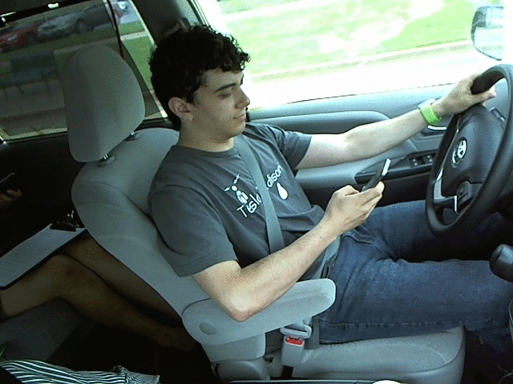

# Distracted Driver Detection

Deep learning-based system to detect driver distraction using computer vision.

## Demo

## Features
- Detects distracted driving behavior
- CNN-based image classification
- Suitable for real-time applications

## Tech Stack
- Python
- TensorFlow / Keras
- OpenCV

## Project Structure
- distracted_driver_detection.ipynb – model implementation
- assets/driver.gif – demo output

## How to Run
1. Open the notebook in Jupyter
2. Install required dependencies
3. Run all cells

## Use Case
Can be used in driver monitoring systems to improve road safety.
